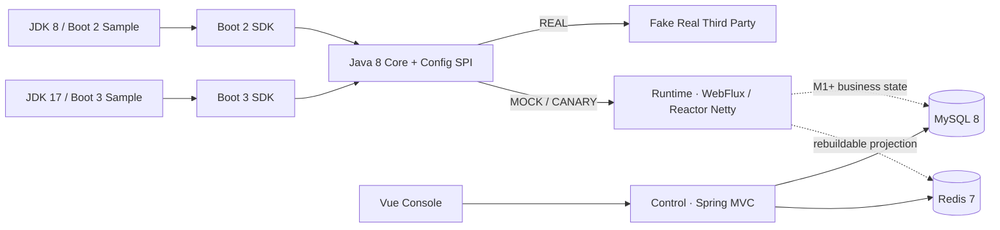

# 巡天第三方接口 Mock 平台

当前仓库实现 **Phase 0 + M0 技术 PoC**：业务应用在方法上声明 `@ThirdPartyMock`，SDK 可在不重启应用的情况下选择 REAL、MOCK 或受控 CANARY 路由，并通过 Feign/RestTemplate 将请求复制、脱敏后发送到 Runtime。Runtime 当前只返回明确的 M0 固定响应；Provider/API/Contract、Scenario、Release、Flow、Callback、AI 等 M1+ 能力尚未实现。

## 架构



边界：SDK 只做调用路由与传输适配，不匹配 Scenario；Control 是管理面，不参与单次 Mock 决策；Runtime 是唯一数据面决策点；Runtime 永不代理真实第三方。

## 模块职责

| 模块 | JDK | 职责 |
|---|---:|---|
| `mock-client-annotation` | 8 | `@ThirdPartyMock` 契约 |
| `mock-client-core` | 8 | Context、不可变路由快照、URL 改写、Header 脱敏、失败策略 |
| `mock-client-config-spi` | 8 | 配置 Provider SPI 与 M0 `LocalConfigProvider` |
| `mock-client-apollo-adapter` | 8 | Apollo 回调边界；未接真实 Apollo 客户端 |
| `mock-client-nacos-adapter` | 17 | Nacos 回调边界；未接真实 Nacos 客户端 |
| `mock-client-boot2-starter` | 8 | Boot 2 AOP、Feign Client 装饰器、RestTemplate RequestFactory 装饰器 |
| `mock-client-boot3-starter` | 17 | Boot 3 对应适配，和 Boot 2 完全隔离 |
| `mock-platform-common` | 17 | 平台错误、响应、分页、脱敏、校验和、时钟、Request/Trace ID |
| `mock-platform-control` | 17 | 管理面骨架、健康检查、本地身份/RBAC Port、Flyway/MyBatis/Redis 门禁 |
| `mock-platform-runtime` | 17 | HTTP/1.1 Reactor Netty 数据面、MockApp 身份、1 MiB 限制、M0 固定响应 |
| `mock-fake-real-third-party` | 17 | OA/CPS_EQB 真实目标替身与调用计数 |
| `mock-sample-jdk8` | 8 | Boot 2 + OpenFeign + RestTemplate 长期兼容性 Harness |
| `mock-sample-jdk17` | 17 | Boot 3 + OpenFeign + RestTemplate 端到端 Harness |
| `mock-platform-web` | Node 20+ | Vue 3 控制台壳、Dashboard、Control/Runtime 健康状态 |

完整依赖关系见 [module-dependencies.md](docs/architecture/module-dependencies.md)。

## 环境要求

- JDK 8 和 JDK 17；两者都必须是真实安装，不以 `source/target` 代替。Maven 主进程必须由 JDK 17 启动。
- Docker + Docker Compose（启动 MySQL 8、Redis 7，以及执行 Testcontainers 门禁）。
- Node.js `>=20.19.0` 与 npm。
- 首次运行 Maven Wrapper/npm 需要访问依赖仓库。

### 配置 Maven Toolchains

PowerShell：

```powershell
$env:MOCK_JDK8_HOME = '<JDK 8 安装目录>'
$env:MOCK_JDK17_HOME = '<JDK 17 安装目录>'
$env:JAVA_HOME = $env:MOCK_JDK17_HOME
Copy-Item .mvn\toolchains.xml.example .mvn\toolchains.xml
```

编辑 `.mvn/toolchains.xml` 中的两个 `jdkHome`。该文件被 Git 忽略。详细说明见 [maven-toolchains.md](docs/development/maven-toolchains.md)。

```powershell
.\mvnw.cmd -t .mvn\toolchains.xml -v
```

## 从零启动

### 1. 启动 MySQL 和 Redis

```powershell
Copy-Item .env.example .env
# 编辑 .env，替换两个本地数据库密码占位值
docker compose --env-file .env -f deploy\docker-compose.yml up -d
docker compose --env-file .env -f deploy\docker-compose.yml ps
```

Compose 提供 MySQL `8.0.36`、Redis `7.2-alpine`、持久卷和健康检查。`.env` 不应提交。

### 2. 构建后端

```powershell
.\mvnw.cmd -t .mvn\toolchains.xml clean verify
```

如果 Docker 可用，`InfrastructureGateTest` 会启动隔离的 MySQL/Redis，验证 Flyway、MyBatis、事务回滚、Redis namespace 与 TTL；Docker 不可用时 Testcontainers 会明确跳过该门禁。

### 3. 设置本地服务环境变量

在启动 Control/Runtime 的终端设置：

```powershell
$env:MOCK_MYSQL_URL = 'jdbc:mysql://localhost:3306/mock_platform?useSSL=false&allowPublicKeyRetrieval=true&serverTimezone=Asia/Shanghai'
$env:MOCK_MYSQL_USERNAME = 'mock'
$env:MOCK_MYSQL_PASSWORD = '<与 .env 中 MYSQL_PASSWORD 一致>'
$env:MOCK_REDIS_HOST = 'localhost'
$env:MOCK_REDIS_PORT = '6379'
```

生产配置没有数据库密码、第三方 Token 或公司 Secret 默认值。

### 4. 启动后端进程

分别打开终端执行：

```powershell
& "$env:MOCK_JDK17_HOME\bin\java.exe" -jar mock-platform-control\target\mock-platform-control-0.1.0-SNAPSHOT.jar --spring.profiles.active=local
```

```powershell
& "$env:MOCK_JDK17_HOME\bin\java.exe" -jar mock-platform-runtime\target\mock-platform-runtime-0.1.0-SNAPSHOT-exec.jar --spring.profiles.active=local
```

```powershell
& "$env:MOCK_JDK17_HOME\bin\java.exe" -jar mock-fake-real-third-party\target\mock-fake-real-third-party-0.1.0-SNAPSHOT-exec.jar
```

本地身份实现只在 `local`/`test` Profile 生效；其他 Profile 使用 fail-closed 实现，直到公司 SSO/Service Identity 接入。

健康检查：

```powershell
Invoke-RestMethod http://localhost:19090/api/platform/health
Invoke-RestMethod http://localhost:19091/actuator/health
Invoke-RestMethod http://localhost:19092/actuator/health
```

### 5. 启动并调用两个 Sample

在各自终端选择启动时路由模式；自动化测试另外验证了运行中 `REAL → MOCK → REAL`，无需重启。

```powershell
$env:MOCK_MODE = 'MOCK'
& "$env:MOCK_JDK8_HOME\bin\java.exe" -jar mock-sample-jdk8\target\mock-sample-jdk8-0.1.0-SNAPSHOT.jar --spring.profiles.active=local
```

```powershell
$env:MOCK_MODE = 'MOCK'
& "$env:MOCK_JDK17_HOME\bin\java.exe" -jar mock-sample-jdk17\target\mock-sample-jdk17-0.1.0-SNAPSHOT.jar --spring.profiles.active=local
```

```powershell
Invoke-RestMethod -Method Post 'http://localhost:19093/demo/oa/reviews?businessNo=SETTLE-M0'
Invoke-RestMethod -Method Post 'http://localhost:19094/demo/cps/signatures?settleId=42'
```

将 `MOCK_MODE` 改为 `REAL` 后，新启动的 Sample 会访问端口 `19092` 的 Fake Real 服务。M0 固定映射为 `OA_SETTLE_CREATE`、`OA_NUMBER_QUERY`、`CPS_SIGN_CREATE_START`、`CPS_FLOW_FILES`；OA 返回成功码 `200`，CPS 返回成功码 `0`。

### 6. 启动 Web

```powershell
Set-Location mock-platform-web
npm ci
npm run dev
```

访问 `http://localhost:5173/mock/dashboard`。Vite 将 `/api` 代理到 Control，将 `/runtime-actuator` 代理到 Runtime。

## 验证命令

```powershell
.\mvnw.cmd -t .mvn\toolchains.xml clean verify
Set-Location mock-platform-web
npm ci
npm run type-check
npm run lint
npm run build
```

可使用 `scripts/verify.ps1` 执行同一组检查；传入 `-WithDocker` 时还会启动并检查 Compose。

关键自动化覆盖：真实 JDK 8/17 toolchain、两代 OpenFeign/RestTemplate、实际 Runtime、REAL/MOCK/REAL、不可变原请求、Runtime 实收 Header 脱敏、Context 嵌套/异常清理、三种失败策略、Retry Request ID、四客户端连接中断以及 Fake Real 调用次数。

## 当前阶段与限制

已完成 Phase 0 工程骨架和 M0 SDK/Runtime 纵向 PoC。Apollo、Nacos 仅完成适配边界，SSO/RBAC/Service Identity 仅有 `local`/`test` 实现，KMS、mTLS、服务发现、实例摘流和公司监控尚未接入。详情见 [external-dependencies.md](docs/m0/external-dependencies.md)。

下一阶段仅建议进入 M1：Provider/API/Contract、Scenario、简单白名单 Template 和 RequestLog。当前不得把 M0 固定响应包装成完整业务能力，也不应提前实现 Flow、Callback、Security Policy 或 AI。
