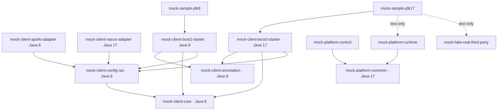

# 模块依赖

## 依赖图

`mock-platform-web` 是独立 npm 工程，不进入 Maven Reactor。

## 隔离规则

- Java 8 链：annotation、core、config-spi、Apollo adapter、Boot 2 starter、JDK 8 sample。所有编译和测试由 JDK 8 toolchain 执行。
- Java 17 链：Nacos adapter、Boot 3 starter、platform common/control/runtime、Fake Real、JDK 17 sample。
- 根 POM 是纯 aggregator/dependency/plugin management，不继承任一 Spring Boot parent。
- Boot 2 和 Boot 3 模块各自导入对应 BOM；core/SPI 不导入 Spring Boot、Jakarta、Control 或 Runtime。
- Boot 3 starter 复用 Java 8 core 的公开契约，但不把 Boot 3/Jakarta 依赖反向传入 Java 8 模块。
- SDK 主链路不依赖 `mock-platform-control` 或 `mock-platform-runtime`；Runtime 只是 HTTP 对端。

## 版本基线

| 线 | Spring Boot | Spring Cloud | Java |
|---|---:|---:|---:|
| Legacy | 2.7.15 | 2021.0.5 | 8 |
| New/Platform | 3.1.6 | 2022.0.4 | 17 |
