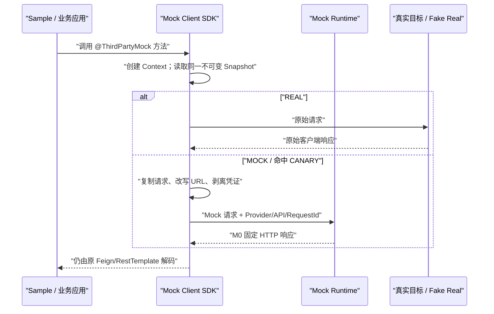

# 架构总览

## 当前范围

仓库只实现 Phase 0 与 M0。M0 用固定响应证明 SDK、两代 Java/Boot 客户端、Runtime 和真实目标替身之间的纵向链路成立；它不是 Scenario 平台的假实现。

## 强制边界

- Runtime 是唯一 Mock 决策数据面；SDK 不做 Scenario Match，Control 不参与单次调用。
- MySQL 是后续可恢复业务状态的唯一事实来源；Redis 只能是可重建投影、短期键或缓存。
- Runtime 不访问真实第三方；只有 SDK 的明确 REAL 路由会访问原 URL。
- 默认失败策略为 `FAST_FAIL`。只有可重放请求、明确连接前失败、非生产环境、且真实 Host 命中精确白名单时，才允许 `FALLBACK_REAL`。
- Local 身份与权限实现仅在 `local`/`test` Profile 注册；其他 Profile fail-closed。
- 当前不支持 Provider/Contract/Scenario/Release/Flow/Callback/AI，相关类、表和前端页面均未预建。

## 数据面约束

- Runtime 固定使用 HTTP/1.1 Reactor Netty；请求聚合上限为 1 MiB。
- Runtime 认证以 `Authorization: MockApp <token>` 解析出的身份为准，不信任调用方自报的 `X-Mock-App`。
- M0 请求记录只保留安全元数据、Header 名称和认证 scheme，不保存凭证或完整 Body。
- 为 M1 后续阻塞 JDBC 预留的 Scheduler 是有界的（8 threads、1000 queue）；当前固定响应路径不访问数据库。

## 管理面约束

Control 只提供健康、统一响应/异常、本地身份/RBAC 骨架和 Dashboard 汇总。MySQL/Redis/Flyway/MyBatis 的当前代码仅是基础设施门禁，不代表业务模型已经实现。
