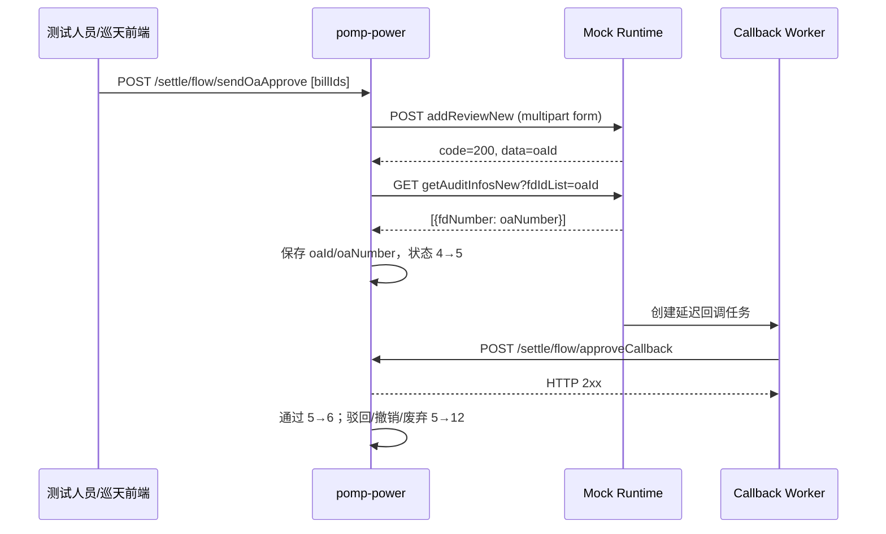
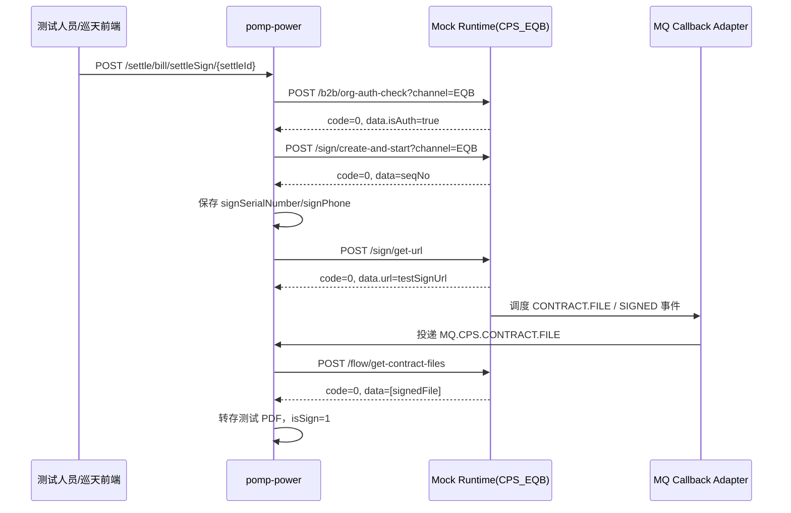

# OA 与 e 签宝第三方集成盘点及 Mock 样板

> 文档状态：源码盘点稿
> 盘点日期：2026-08-17
> 适用阶段：Mock Platform M0 PoC / M4 样板
> 代码基线：`D:\workspace\java` 当前工作区
> 安全说明：本文不记录真实域名、IP、账号、Token、AppSecret、Cookie 或签名密钥。

## 1. 结论先行

1. OA 与 e 签宝相关的后端集成集中在 `pomp-power`；`xuntian-ui` 只有页面和巡天内部 API 调用，不直接调用第三方。
2. OA 是巡天直接通过 HTTP 网关调用，主要使用 `RestTemplate`/Hutool HTTP；回调是 OA 主动调用巡天 HTTP 接口。
3. e 签宝并非巡天直接调用。巡天先调用合同中台 CPS，使用 `channel=EQB` 选择 e 签宝；生产回调由 CPS 通过 RabbitMQ 投递给巡天。
4. 两侧现有代码都没有实现可供 Mock 复刻的应用层加密签名：
   - OA 建单只设置 `Content-Type: multipart/form-data`；
   - CPS HTTP 主要设置 `Content-Type: application/json` 和租户域 Header `domain`；
   - OA HTTP 回调、CPS MQ 消息在业务代码中均未验签。
5. 首批样板建议：
   - OA：结算账单发送核准 → OA 建单 → 查询 OA 流水号 → OA 审批回调；
   - e 签宝：结算单签章 → 机构授权校验 → 创建签章流程 → 获取签署链接 → `SIGNED` 文件事件 → 查询签后文件。
6. 样板落地前必须确认两个缺口：
   - e 签宝创建请求没有稳定的巡天业务号，需要由 SDK Mock Context 提供 `X-Mock-Business-No`；
   - 签后文件查询返回下载 URL，MVP 不做文件流代理，应预置测试 PDF 并返回可访问的静态测试地址。

## 2. 盘点范围与口径

本次扫描了 `D:\workspace\java` 下巡天子项目中与 `OA`、`jgCps`、`e签宝`、合同回调和状态枚举相关的源码，重点核对：

- 巡天内部触发入口；
- 第三方 HTTP 方法、Path、Content-Type、Header；
- 请求和响应 DTO；
- 业务成功码、错误码和流程状态；
- HTTP/MQ 回调入口、关联键和幂等行为；
- 认证、签名和敏感字段处理；
- 对 Mock Platform Flow、Scenario、Callback 的映射。

本次不包含共享平台、短信、OCR、FastDFS、结算平台等其他第三方的完整盘点；它们应在首批两个样板验证完成后按同一模板补充。

## 3. OA 集成盘点

### 3.1 活跃调用点

| 能力 | 第三方契约 | 主要适配器 | 活跃业务调用方 | 说明 |
|---|---|---|---|---|
| 创建/更新 OA 审批 | `POST ${oa.gateway}/api/km-review/kmReviewRestService/addReviewNew` | `SettleApprovalRest.approvePush`、`OaApproveServiceImpl.approvePush` | 结算、准入、新签、续签、变更、三方协议、协议流程 | `multipart/form-data`，表单内嵌 JSON 字符串 |
| 查询 OA 流水号 | `GET ${oa.gateway}/api/tcl-cpms/cpmsAuditRestService/getAuditInfosNew` | `SettleApprovalRest.getOaNumber` | 结算账单 | Query：`fdIdList`；响应为数组 |
| 推送签后合同/推进 OA | `POST ${oa.gateway}/api/km-review/kmReviewRestService/approveProcessNew` | `OaApproveServiceImpl.pushContractToOa` | 合同抽象流程、协议流程、准入 | `multipart/form-data`，可携带合同附件 |
| 撤销 OA 流程 | 同上 | `SettleApprovalRest.cancelApprovePush`、`OaApproveServiceImpl.cancelSyncOa` | 准入、合同管理、合同抽象流程 | `fdId + flowParam` |
| 下载 OA 审批 PDF | `POST ${oa.file-base}/api/tcl-cloud/tclReviewDataRestService/downloadFileDFYC` | `StBillOaFileService.downloadOAFile` | 结算附件归档 | JSON 请求；存在 `X-Agp-Appkey` Header，但源码中的值不是加密签名 |
| OA 审批结果回调 | `POST /settle/flow/approveCallback` | `SettleFlowController.approveCallback` | OA → 巡天结算 | JSON：`oaId/status/remark` |

补充说明：`OperatorAccessOaApprovalRest` 与 `OaApproveController` 中相关代码已整体注释，不计入活跃契约。

### 3.2 OA 建单契约

请求：

```http
POST ${oa.gateway}/api/km-review/kmReviewRestService/addReviewNew
Content-Type: multipart/form-data
```

表单字段：

| 字段 | 类型 | 必填性 | 说明 |
|---|---|---|---|
| `docCreator` | JSON String | 是 | `{"LoginName":"..."}`，巡天从当前用户 OA 账号生成 |
| `docSubject` | String | 是 | 审批主题 |
| `fdTemplateId` | String | 是 | OA 模板 ID；文档与 Mock 数据中使用环境变量，不记录真实值 |
| `fdMainId` | String | 否 | 已存在 OA 流程时用于更新/续推 |
| `formValues` | JSON String | 是 | 业务表单值 |
| `attachmentForms[n].fdKey` | String | 条件必填 | 附件字段标识 |
| `attachmentForms[n].fdFileName` | String | 条件必填 | 文件名 |
| `attachmentForms[n].fdAttachment` | File | 条件必填 | 文件内容；首个结算样板当前不设置该字段 |

结算样板的 `formValues`：

```json
{
  "fd_quantity": "2",
  "fd_all_amount": "1200.50",
  "fd_task_no": "${businessNo}",
  "fd_url": "${testAttachmentUrl}",
  "fd_itemList": [
    {
      "fd_itemList.fdId": "${businessNo}_1",
      "fd_itemList.fd_operator_name": "测试运维商",
      "fd_itemList.fd_period": "2026-07"
    }
  ]
}
```

统一响应：

```json
{
  "code": "200",
  "message": "success",
  "data": "${oaId}",
  "success": true
}
```

巡天只把 HTTP 200 且响应 `code == "200"` 视为成功；成功时 `data` 被当作 OA 流程 ID。HTTP 非 200、Body 为空或业务码非 `200` 均进入失败分支。

### 3.3 OA 流水号查询契约

```http
GET ${oa.gateway}/api/tcl-cpms/cpmsAuditRestService/getAuditInfosNew?fdIdList=${oaId}
```

巡天取响应数组第一项的 `fdNumber`：

```json
[
  {
    "fdId": "${oaId}",
    "fdNumber": "${oaNumber}"
  }
]
```

查询失败或数组为空时，业务继续执行，但本地 `oaNumber` 为空；因此它不是建单事务的强一致组成部分。

### 3.4 OA 回调契约

```http
POST ${xuntian.callback-base}/settle/flow/approveCallback
Content-Type: application/json
```

```json
{
  "oaId": "${oaId}",
  "status": 0,
  "remark": "审批通过"
}
```

| `status` | 含义 | 巡天处理 |
|---:|---|---|
| `0` | 通过 | 工作流 `PASS` |
| `1` | 驳回 | 工作流 `REJECT`，清理签章信息 |
| `2` | 撤销 | 工作流 `CANCEL`，清理签章信息 |
| `3` | 废弃 | 工作流 `DISCARD`，清理 OA 号和待签附件 |

校验规则：`oaId` 不能为空，`status` 不能为空。当前 Controller 没有回调签名参数或验签逻辑；是否由网关完成鉴权需要 OA/网关负责人确认。

### 3.5 OA 状态码与本地状态

OA/CPS/巡天状态必须分层保存，不能混成一个 `status`：

| 层级 | 代码 | 含义 |
|---|---:|---|
| OA HTTP | `200` | HTTP 成功；非 200 是传输失败 |
| OA 业务响应 | `"200"` | OA 业务成功 |
| OA 回调 | `0/1/2/3` | 通过/驳回/撤销/废弃 |
| 巡天账单流程 | `4` | 待发送核准 |
| 巡天账单流程 | `5` | 待核准 |
| 巡天账单流程 | `6` | 待补充结算资料 |
| 巡天账单流程 | `12` | 核准驳回 |

巡天 OA 适配层可产生的主要本地错误码：

| 错误码 | 含义 |
|---:|---|
| `8013` | 推送 OA 审批异常 |
| `8014` | 推送 OA 审批失败 |
| `8015` | OA 接口返回异常 |
| `8016` | OA 返回值为空 |
| `8017` | OA 审批回调失败 |
| `8018` | 推送合同给 OA 失败 |

这些 `80xx` 是巡天本地错误，不应冒充 OA 原始业务错误码。Mock 场景中应分别记录 `upstreamCode` 与 `xuntianMappedCode`。

## 4. e 签宝 / CPS 集成盘点

### 4.1 调用边界

真实调用关系：

```text
巡天 pomp-power
  -> 合同中台 CPS (${cps.base-url})
     -> channel=EQB
        -> e 签宝
```

因此 Mock Provider 建议命名为 `CPS_EQB`，而不是伪装成巡天直连 e 签宝。这样契约能够准确反映现有 URL、Header、统一响应和 MQ 事件。

### 4.2 活跃业务调用面

`JgCpsService` 在当前源码中有 68 个活跃调用点，覆盖以下业务域：

| 业务域 | 主要类 | 使用能力 |
|---|---|---|
| 运维商准入/合同 | `AccessContractService`、`ContractMatterAbstract` | 授权、创建流程、签署链接、加签署区、完成、查询签后文件 |
| 合同变更/续签/解除/区域 | `ChangeContractMatterService`、`RenewalContractMatterService`、`RemovePowerContractService`、`AreaService` | 创建、签署链接、完成、作废、文件查询 |
| 三方协议 | `TripartiteProtocolService` | 创建、甲丙方签章、完成、文件查询 |
| 账单/结算单 | `StBillServiceImpl`、`SettleBillServiceImpl` | 授权、创建、签署链接、签后文件、PDF 转换 |
| 机组注册 | `GecVppRegAutoSealSupport`、`GecVppRegCpsSealHelper` | 容错创建、批量查询、作废、签后文件 |
| 函件/模板 | `LetterFilePdfHelper`、`OmContractTemplateServiceImpl` | Word/PDF 转换、模板填充 |

按方法统计的重点调用量：`flowGetContractFiles` 15 次、`signGetUrl` 12 次、`fileTemplateFilling` 9 次、`signCreateAndStart` 7 次、`partyAPushCps` 7 次、`complete` 6 次。

### 4.3 CPS HTTP 契约清单

所有 Base URL 均写为 `${cps.base-url}`。除特别说明外，请求和响应均为 JSON。

| 能力 | Method/Path | 关键请求 | 响应 `data` | 当前调用 |
|---|---|---|---|---|
| 机构授权校验 | `POST /b2b/org-auth-check?channel=EQB` | `orgInfo`、`sealNameList`、`getUrl`、`notifyChannels` | `isAuth/isRealName/isSealExist/url/tips` | 活跃 |
| 创建并启动签章 | `POST /sign/create-and-start?channel=EQB` | 文件、标题、企业签署方、签署区、`autoFinish` | `seqNo` | 活跃 |
| 动态渠道创建 | 同上，`channel` 可为 `EQB/SSQ/ESS` | 同上 | `seqNo` | 接口存在，当前业务未调用 V2 |
| 增加签署区/签署方 | `POST /sign/add-sign-fields` | `seqNo/personSigners/companySigners` | 空 | 活跃 |
| 获取签署链接 | `POST /sign/get-url` | `seqNos/signerMobile/notifyChannels` | `{url}` | 活跃 |
| 查询签署文件 | `POST /flow/get-contract-files` | `seqNo/flowState/signerIdentity/returnDownloadUrl` | 文件数组 | 活跃 |
| 查询签署人 | `GET /flow/{seqNo}/signers` | Path：`seqNo` | 签署人数组 | 活跃 |
| 批量查询流程 | `POST /flow/list` | `seqNo` 数组 | `CpsSignflowDTO[]` | 活跃 |
| 完成签章 | `POST /sign/complete` | `seqNo/flowEndTime` | 空 | 活跃 |
| 作废签章 | `POST /sign/revoke` | `seqNo/reason` | 空 | 活跃 |
| 模板填充/转 PDF | `POST /file/template-filling?channel=EQB` | Base64 文件和填充值 | Base64/PDF | 活跃 |
| 文件转 PDF | `POST /file/file-to-pdf` | `fileBase64` | `fileBase64` | 活跃 |
| 关键词坐标 | `POST /file/find-keyword-positions` | `keywords` 与文件来源 | 关键词坐标 Map | 接口存在，当前无业务调用 |

### 4.4 Header、认证与签名

| 链路 | 当前源码行为 | Mock 处理 |
|---|---|---|
| CPS 直接 HTTP | `Content-Type: application/json`；大多数接口增加 `domain: ${cps.domain}` | SDK 在 Mock 副本中删除真实敏感 Header；`domain` 可作为普通业务 Header 保留或由 Provider 默认值补齐 |
| CPS Feign | `CpsConfiguration` 自动增加 `domain` | 同上 |
| 加密签名 | 未发现 timestamp、nonce、HMAC/RSA 或签名 Header | 不编造签名；登记为待合同中台负责人确认 |
| MQ 回调 | 业务代码不验签 | 依赖 RabbitMQ 连接、Exchange/Queue 权限；Mock Callback Worker 不应伪造为 HTTP 签名回调 |

`domain` 是租户/业务域标识，不是加密签名，也不能当作调用方身份凭证。

### 4.5 统一响应与错误码

CPS 统一响应：

```json
{
  "code": "0",
  "message": "ok",
  "data": {}
}
```

巡天直接 HTTP 实现主要只判断 `code == "0"`；非 `0` 为业务失败。代表性代码来自当前 `jgcloud-cps-api` 依赖：

| code | 名称 | 用途 |
|---:|---|---|
| `0` | `Ok` | 成功 |
| `1` | `Failed` | 通用失败 |
| `2` | `EQBFailed` | e 签宝下游失败 |
| `3` | `SSQFailed` | 上上签下游失败 |
| `400000` | `BadRequest` | 请求参数异常 |
| `400001` | `BadBody` | 请求体异常 |
| `400002` | `FileTypeNotSupport` | 文件类型不支持 |
| `410000` | `ChannelNotBlank` | 渠道为空 |
| `410001` | `DomainNotBlank` | 业务域为空 |

完整错误枚举来自 SNAPSHOT 依赖，可能变化。Mock Contract 应先导入本次样板实际使用的代码，其他错误码由真实报文或正式 CPS 文档确认后再发布。

### 4.6 CPS 流程状态与回调

CPS 流程状态：

| 状态 | 含义 | 当前消费者行为 |
|---|---|---|
| `EMPTY` | 未知/空状态 | 过滤 |
| `CREATED` | 已创建 | 文件事件消费者过滤 |
| `PRE_START` | 预发起 | 文件事件消费者过滤 |
| `SIGNING` | 签署中 | 文件事件消费者接收 |
| `REJECTED` | 拒签 | 文件事件和流程状态消费者接收 |
| `SIGNED` | 已签署 | 文件事件消费者接收 |
| `OBSOLETED` | 已作废 | 文件事件消费者过滤 |
| `TERMINATING` | 解约中 | 文件事件消费者过滤 |
| `TERMINATED` | 已解约 | 文件事件消费者过滤 |

生产回调是两条 MQ：

| Queue | 消息格式 | 当前处理 |
|---|---|---|
| `MQ.CPS.CONTRACT.FILE` | JSON 数组，元素为 `CpsContractFileChangedEvent` | 只取数组第一项；处理 `SIGNING/SIGNED/REJECTED` |
| `MQ.CPS.SIGNFLOW.STATE.CHANGED` | 单个 `CpsSignflowDTO` JSON | 通用合同链路只处理 `REJECTED` |

文件事件的关键字段：

```json
[
  {
    "seqNo": "${seqNo}",
    "flowState": "SIGNED",
    "signerIdentity": "${maskedIdentity}",
    "fileId": "${fileId}",
    "fileName": "结算单",
    "fileType": "pdf",
    "sha256": "${sha256}",
    "fileUrl": "${testFileUrl}",
    "isAttachment": false
  }
]
```

回调关联键是 `seqNo`。Consumer 使用 `ackMode=AUTO`，但捕获异常后不再抛出；这意味着业务处理失败时消息可能被确认而不重试，Mock 的“回调失败重试”不能把现有 MQ Consumer 的行为误认为已具备可靠重试。

## 5. 样板一：OA 结算核准主链路

### 5.1 选择理由

- 有明确巡天 HTTP 触发入口和 OA HTTP 回调入口；
- 有创建、查询、异步回调，能验证 Mock Flow 的跨接口关联；
- 业务键 `fd_task_no` 明确；
- 通过、驳回、撤销、废弃四种状态均有源码定义；
- 首个样板不携带实际二进制附件，只使用 `fd_url`，可避开 MVP 文件上传能力。

### 5.2 时序



### 5.3 Mock Flow 定义建议

| 配置项 | 建议值 |
|---|---|
| Provider | `OA` |
| API | `OA_SETTLE_CREATE`、`OA_NUMBER_QUERY` |
| Flow Definition | `OA_SETTLE_APPROVAL_V1` |
| Business Key | 创建请求 `formValues.fd_task_no`；SDK 需在解析 multipart 后提取内嵌 JSON |
| 生成变量 | `oaId=${uuid}`、`oaNumber=MOCK-${businessNo}` |
| 初始状态 | `PENDING` |
| 回调状态 | `APPROVED/REJECTED/CANCELLED/DISCARDED` |
| Callback Target | `/settle/flow/approveCallback`，Base URL 由环境配置，不入 Contract |

若 Runtime M0 不能从 multipart 内嵌 JSON 提取业务键，应由 SDK 增加签名 Mock Context Header `X-Mock-Business-No`；不要退化为按请求 Body Hash 关联。

### 5.4 首批 Scenario 种子

| Scenario | 响应/动作 | 验收点 |
|---|---|---|
| `oa-settle-create-success` | HTTP 200，业务码 `200`，生成 `oaId` | 本地保存 OA ID，账单 4→5 |
| `oa-settle-create-biz-fail` | HTTP 200，非 `200` 业务码 | 不进入待核准，前端收到失败 |
| `oa-settle-create-http-500` | HTTP 500 | 传输失败分支 |
| `oa-settle-create-timeout` | 超过客户端读超时 | 超时分支，不自动访问真实 OA |
| `oa-settle-callback-pass` | 延迟回调 `status=0` | 账单 5→6 |
| `oa-settle-callback-reject` | 延迟回调 `status=1` | 账单 5→12，签章信息被清理 |
| `oa-settle-callback-duplicate` | 同一 `oaId/status` 回调两次 | 暴露或验证业务幂等性 |

## 6. 样板二：e 签宝结算单签章主链路

### 6.1 选择理由

- 巡天入口清楚：`POST /settle/bill/settleSign/{settleId}`；
- 覆盖授权、创建、查询链接、异步事件、查询签后文件；
- 业务只涉及一个运维商签署方，样板数据比合同甲乙双方流程简单；
- `seqNo` 被持久化，可作为后续接口和回调的稳定关联键。

### 6.2 时序



### 6.3 创建签章请求样例

```http
POST ${cps.base-url}/sign/create-and-start?channel=EQB
Content-Type: application/json
domain: ${cps.domain}
X-Mock-Business-No: SETTLE-${settleId}
```

```json
{
  "templateType": "file",
  "fileUrl": "${unsignedTestPdfUrl}",
  "fileName": "结算单.pdf",
  "title": "结算单.pdf",
  "companySigners": [
    {
      "name": "测试运维商",
      "identity": "${maskedIdentity}",
      "transactor": {"mobile": "${maskedMobile}"},
      "autoSign": false,
      "signFields": [
        {"type": "normal", "keyword": "运维商签章", "sealName": "PUBLIC"},
        {"type": "normal", "keyword": "运维商法人盖章", "sealName": "LEGAL_PERSON"},
        {"type": "cross", "page": "all", "y": 0.05}
      ]
    }
  ],
  "autoFinish": true
}
```

成功响应：

```json
{
  "code": "0",
  "message": "ok",
  "data": "${seqNo}"
}
```

### 6.4 签后文件查询样例

请求：

```json
{
  "seqNo": "${seqNo}",
  "returnDownloadUrl": true,
  "flowState": "SIGNED"
}
```

响应：

```json
{
  "code": "0",
  "message": "ok",
  "data": [
    {
      "fileName": "结算单-已签署",
      "fileType": "pdf",
      "flowState": "SIGNED",
      "fileId": "${fileId}",
      "sha256": "${sha256}",
      "downloadUrl": "${signedTestPdfUrl}"
    }
  ]
}
```

`${signedTestPdfUrl}` 必须指向测试环境可访问的预置 PDF。Mock Runtime 只返回元数据和 URL，不承担文件上传、下载或代理。

### 6.5 Mock Flow 定义建议

| 配置项 | 建议值 |
|---|---|
| Provider | `CPS_EQB` |
| API | `CPS_ORG_AUTH_CHECK`、`CPS_SIGN_CREATE_START`、`CPS_SIGN_GET_URL`、`CPS_FLOW_FILES` |
| Flow Definition | `CPS_EQB_SETTLE_SIGN_V1` |
| Business Key | `X-Mock-Business-No=SETTLE-${settleId}` |
| 生成变量 | `seqNo=MOCK-EQB-${uuid}`、`fileId=${uuid}` |
| 状态 | `CREATED → SIGNING → SIGNED`；失败终态 `REJECTED/OBSOLETED` |
| 回调类型 | `RABBIT_MQ`，目标 Queue `MQ.CPS.CONTRACT.FILE` |
| 回调 Payload | JSON 数组，必须保持与现有 Consumer 一致 |

Mock Platform 当前方案的 Callback Worker 以 HTTP 为主。若 M4 不实现 MQ Adapter，Pilot 可调用现有测试入口 `POST /contractManage/callback` 模拟同一 Consumer，但必须标记为测试适配，不能把它写成生产回调契约。

### 6.6 首批 Scenario 种子

| Scenario | 响应/动作 | 验收点 |
|---|---|---|
| `cps-eqb-auth-ok` | `code=0, data.isAuth=true` | 继续创建流程 |
| `cps-eqb-auth-required` | `code=0, data.isAuth=false, data.url=...` | 返回授权提示/链接 |
| `cps-eqb-create-success` | `code=0`，生成 `seqNo` | 本地保存签章流水号 |
| `cps-eqb-create-fail` | `code=2` | 创建失败分支 |
| `cps-eqb-get-url-success` | 返回固定测试签署页 | 前端可打开测试页 |
| `cps-eqb-signed-event` | 延迟投递 `SIGNED` 文件事件 | 查询签后文件并置 `isSign=1` |
| `cps-eqb-signed-duplicate` | 重复投递相同事件 | 验证重复转存/幂等风险 |
| `cps-eqb-out-of-order` | 先 `SIGNED` 后 `SIGNING` | 验证状态不可倒退 |

当前结算单链路没有可靠的拒签闭环：文件事件消费者允许 `REJECTED`，但 `SettleBillServiceImpl.completeBillSign` 未再次判断 `flowState`；流程状态拒签 Consumer 也没有路由到结算单。`REJECTED` 场景应先作为缺陷复现用例，不能作为“预期已正确处理”的验收用例。

## 7. 签名、回调和安全结论

| 项目 | OA | CPS_EQB/e 签宝 | Mock Platform 要求 |
|---|---|---|---|
| 出站认证 | 源码未见认证/签名 Header | `domain` Header，不是签名 | Mock 副本删除真实凭证；未知认证由负责人确认 |
| 回调认证 | Controller 未验签 | MQ Consumer 未验签 | 测试环境使用服务身份、Queue ACL；不得记录真实密钥 |
| 回调关联键 | `oaId` | `seqNo` | Flow 内唯一，重复回调使用相同键 |
| 幂等性 | 未见独立回调事件 ID | 未见独立回调事件 ID | Scenario 必须覆盖重复和乱序；不要宣称业务天然幂等 |
| 敏感数据 | OA 账号、附件、合同信息 | 企业名称、信用代码、手机号、文件 URL | 日志/审计按字段脱敏，Payload 加密保存 |
| 重试 | OA 调用代码无重试 | MQ 异常被捕获，可能不触发 Broker 重试 | Mock Callback Retry 只代表平台能力，不代表业务消费可靠性 |

## 8. M0/M4 落地顺序

1. 先录入四个最小 Contract：`OA_SETTLE_CREATE`、`OA_NUMBER_QUERY`、`CPS_SIGN_CREATE_START`、`CPS_FLOW_FILES`。
2. 用固定响应验证 Feign/RestTemplate 的 REAL/MOCK 切换和敏感 Header 删除。
3. 验证 `multipart/form-data` 中普通字段和内嵌 JSON 的解析；失败则统一使用签名 Mock Context BusinessNo。
4. 实现 OA HTTP Callback 样板，覆盖通过、驳回、重复回调。
5. 为 CPS 增加最小 MQ Callback Adapter；若排期不足，Pilot 暂用现有 HTTP 测试入口并登记技术债。
6. 预置未签和已签测试 PDF，禁止 Runtime 任意访问用户传入 URL。
7. 修正或确认结算单 `REJECTED` 处理后，再把拒签纳入正式验收。
8. 首批样板稳定后，再盘点共享平台并扩展到每类至少 3 个核心接口。

## 9. 待确认问题

| 优先级 | 问题 | 负责人建议 | 未确认影响 |
|---|---|---|---|
| P0 | OA 建单、OA 回调是否由网关增加认证或签名 | OA/网关负责人 | 无法准确配置 Header 过滤和回调验签 |
| P0 | CPS MQ 回调的 Exchange、Routing Key、测试环境发布权限 | 合同中台/RabbitMQ 负责人 | Mock 无法按生产形态投递回调 |
| P0 | 结算单拒签预期状态与修复方案 | 结算业务负责人 | 不能验收 e 签宝失败/拒签闭环 |
| P0 | 测试 PDF 的固定托管位置和生命周期 | 测试平台/文件服务负责人 | `flow/get-contract-files` 成功后业务仍会失败 |
| P1 | OA/CPS 完整错误码及正式契约版本 | OA/CPS 负责人 | 只能覆盖已知和合成错误场景 |
| P1 | 回调重复、乱序的业务幂等规则 | 结算/合同负责人 | Mock 可复现但无法判定期望结果 |
| P1 | `X-Mock-Business-No` 的注入方式 | Mock SDK 负责人 | e 签宝 Flow 无稳定测试隔离键 |

## 10. 源码证据索引

以下路径均相对 `D:\workspace\java\pomp-power`：

| 主题 | 文件与关键行 |
|---|---|
| OA 建单/查询/撤销 | `pomp-power-svc/src/main/java/cn/getech/iot/power/rest/SettleApprovalRest.java:43`、`:66`、`:112`、`:192` |
| OA 通用适配器 | `pomp-power-svc/src/main/java/cn/getech/iot/power/service/external/impl/OaApproveServiceImpl.java:47`、`:82`、`:104`、`:195` |
| OA 统一响应 | `pomp-power-svc/src/main/java/cn/getech/iot/power/dto/operatorAccess/RestResponse.java:12` |
| OA 本地错误码 | `pomp-power-svc/src/main/java/cn/getech/iot/power/enums/operatorAccess/OperatorAccessExceptionEnum.java:39` |
| OA 结算回调 DTO | `pomp-power-api/src/main/java/cn/getech/iot/power/dto/st/StOACallbackReq.java:14` |
| OA 回调入口 | `pomp-power-svc/src/main/java/cn/getech/iot/power/controller/settle/SettleFlowController.java:70` |
| OA 结算链路 | `pomp-power-svc/src/main/java/cn/getech/iot/power/service/settle/impl/SettleProcessServiceImpl.java:394`、`:2144`、`:2178`、`:2204`、`:2283` |
| OA 状态迁移 | `pomp-power-svc/src/main/java/cn/getech/iot/power/dto/flow/SettleFlowEnum.java:44`、`:50` |
| OA 文件下载 | `pomp-power-svc/src/main/java/cn/getech/iot/power/service/settle/StBillOaFileService.java:86`、`:109` |
| CPS 业务接口 | `pomp-power-svc/src/main/java/cn/getech/iot/power/service/external/JgCpsService.java:20` |
| CPS HTTP 实现 | `pomp-power-svc/src/main/java/cn/getech/iot/power/service/external/impl/JgCpsServiceImpl.java:47`、`:134`、`:184`、`:380`、`:412` |
| CPS Feign Header | `pomp-power-svc/src/main/java/cn/getech/iot/power/config/CpsConfiguration.java:15` |
| CPS MQ Consumer | `pomp-power-svc/src/main/java/cn/getech/iot/power/mq/ContractCPSConsumer.java:24`、`:47`、`:77` |
| e 签宝结算单入口 | `pomp-power-svc/src/main/java/cn/getech/iot/power/controller/settle/SettleBillController.java:552` |
| e 签宝结算单链路 | `pomp-power-svc/src/main/java/cn/getech/iot/power/service/settle/impl/SettleBillServiceImpl.java:264`、`:307`、`:790` |
| e 签宝请求 DTO | `pomp-power-api/src/main/java/cn/getech/iot/power/dto/ContractSignSubjectDTO.java:19`、`ContractSignerDTO.java:19` |
| 签署请求组装/授权 | `pomp-power-svc/src/main/java/cn/getech/iot/power/service/settle/impl/StBillServiceImpl.java:1841`、`:1920`、`:1962` |
| CPS 回调业务路由 | `pomp-power-svc/src/main/java/cn/getech/iot/power/service/impl/OmContractInfoServiceImpl.java:822`、`:844`、`:885` |
| CPS 测试回调入口 | `pomp-power-svc/src/main/java/cn/getech/iot/power/controller/operator/OmContractManageController.java:357` |
| CPS API 依赖版本 | `pomp-power-svc/pom.xml:68` |

依赖 JAR 中的 `CpsResult`、`CpsSignflowDTO`、`CpsContractFileChangedEvent`、`CpsSignflowStateEnum` 和 `CpsErrorCode` 已通过当前 Maven 本地依赖反编译签名核对；它们不是本仓库源码，升级 `jgcloud-cps-api` 后必须重新生成 Contract Diff。
